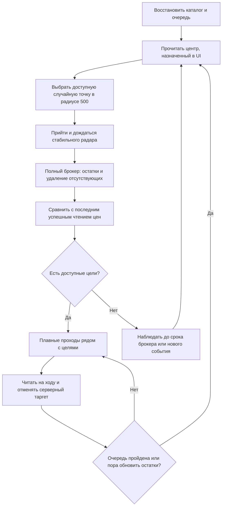

# Цикл одного сборщика рынка

Исторический проект, заменённый локальным планированием в SQLite.
Текущее поведение — [COLLECTION_CYCLE.md](../../COLLECTION_CYCLE.md),
сервер и приёмка — [RESUME.md](../../RESUME.md).

Статус: проект следующего рабочего цикла, 25.09.2026. Полный цикл ещё не
включён в production. Основание: требования Павла и проверенный проход
`20260925-134332` — четыре лавки, 22 точных лота, без застреваний.
Подтверждённое уточнение: неизменную лавку перепроверять **раз в 24 часа**.
Центр задаёт пользователь через существующий UI, отдельно для профиля/города.
По уточнению пользователя весь рынок виден из любой точки радиуса 500.
Один завершённый полный брокерный проход убирает отсутствующих трейдеров
из активного рынка и очереди; история остаётся.

## Что делает цикл

Единица владения — профиль и один PID. Радар наблюдает непрерывно; брокер и
движение/чтение цен получают командный канал по очереди. Загрузка результатов
на сервер идёт независимо. Цель обхода — все **нуждающиеся в цене** трейдеры;
проходить мимо каждой уже проверенной неизменной лавки в каждом цикле незачем.

## Центр и случайная точка

1. Пользователь назначает центр через существующий UI. Используем сохранённую
   настройку профиля и города; без центра цикл не запускается. Автоматического
   расчёта центра по плотности, смещения вслед за персонажем и обследования
   нескольких центральных точек не требуется.
2. Центр и версию настройки фиксируем на брокерную эпоху. Если пользователь
   изменил его во время сбора, старый проход не получает права удалять пропавших:
   планируем возврат и новый проход по обновлённой зоне.
3. Выбираем новую случайную **доступную** точку внутри круга радиуса 500:
   правильный этаж, свободная площадка, запас от стен, путь до неё существует.
   Проверяем геометрию и живые коллизии; конечная точка не попадает в препятствие.
4. Случайность равномерна по пригодной площади.
   Не повторяем последние точки и по возможности отступаем от предыдущей
   хотя бы на 100 единиц. Если допустимых вариантов нет, расширять радиус
   молча нельзя: выбираем известную безопасную точку и показываем причину.

**Назначенная пользователем зона радиуса 500 имеет полный обзор рынка** —
это исходное условие этой конфигурации, подтверждённое пользователем.
Проверяем техническую полноту прохода: прогрев, ответы, потери, сессию и
положение внутри зоны. На маршруте вне неё исчезновение объекта из локального
knownlist по-прежнему означает «не виден», а не «ушёл с рынка».

## Брокерная фаза

- Персонаж неподвижен на время одного прохода. Прогрев — минимум 3 секунды
  и стабильные наблюдения; при холодном радаре/переполнении кольца проход частичный.
- Получаем актуальный каталог item ID для типов лавок 1/3/8, затем все ответы
  по этим ID. Не ограничиваемся предметами, известными в предыдущем цикле.
- Проверяем соответствие запросов и ответов, полноту строк, отсутствие потерь,
  сессию и положение персонажа. Нулевой корректный ответ отличаем от таймаута.
- Это интервал наблюдений, не атомарный снимок: сохраняем начало, конец и время
  отдельных фактов. Новые/переоткрытые/переместившиеся во время прохода лавки
  требуют ограниченной повторной проверки затронутых данных.
- Имена связываем с ObjectID только в текущей сессии. Неизвестный ID ждёт
  сопоставления; выдуманное имя `Trader <id>` не становится постоянной личностью.
- Повторы запроса/загрузки не суммируют остатки повторно. Сохраняем эпоху,
  версию центральной зоны и время наблюдений.
- Удалять отсутствующий предмет можно только при полном наблюдении его группы.
  Для подтвердившейся пустой лавки нужен явный пустой инвентарь; её нельзя
  просто потерять из группировки непустых брокерных строк.
- После **одного успешно завершённого полного прохода** по всем item ID и
  типам 1/3/8 сравниваем объединённый список трейдеров с активным каталогом
  этого рынка/города. Отсутствующего трейдера сразу убираем из очереди подходов
  и активной выдачи сервера вместе с предложениями. Историю не удаляем.
  Второй проход или отдельный визит к нему не требуются.
- Применяем удаления атомарно только после завершения эпохи. Таймаут,
  усечённый ответ, потеря пакетов, неразрешённые ID или прерывание допускают
  положительные обновления, но не массовое удаление. Корректный полный ноль
  может очистить активный рынок; старый порог «не менее половины трейдеров»
  для подтверждённой полной эпохи не нужен.
- Более новые появления/переоткрытия, случившиеся во время или после прохода,
  не стираются устаревшей проверкой отсутствия. Они получают свою ревизию
  и проверку затронутых данных; повтор старого радара не воскрешает снятую лавку.

## Когда идти за ценами

Ключ — `(рынок, город, нормализованный ник)`. ObjectID и указатель актёра временные.
Сохраняем последнюю успешную цену, её время, позицию, признаки поколения лавки
и проверенный состав товаров. Сравнение ведём с этой базой, **не с предыдущим
брокерным проходом**. Неудачная попытка не сдвигает базу и не обнуляет причину.

| Событие | Решение |
|---|---|
| Новый трейдер / нет полного достоверного снимка цен | В очередь |
| Появился новый item ID, тип продажи, валюта или подтверждённый вариант | В очередь |
| Увеличилось число отдельных брокерных строк для группы | В очередь как возможный новый лот |
| Лавка закрылась и снова открылась, сменился тип магазина | Новое поколение, в очередь |
| Подтверждённо изменилась позиция относительно проверенной | Обновить координаты, в очередь |
| Прошло 24 часа после успешного чтения | Плановая перепроверка |
| Изменилось только количество | Обновить брокерный остаток, не идти |
| Исчез весь предмет или сократилось число его строк | Скрыть/уточнить доступность, не идти только ради количества |
| Исчез из видимости на ходу | Сохранить цель и последние координаты |
| Отсутствует в завершённом полном брокерном проходе из назначенной зоны | Убрать из активного рынка и очереди; историю сохранить |
| Таймаут, недоступный подход | Отложить с причиной; цену не считать проверенной |
| Перезапуск нашего клиента, массовая смена ObjectID | Пересвязать сессию; не перечитывать автоматически весь рынок |

Мелкое дрожание координат не считается переносом. Начальный порог — 20 единиц
XY, подтверждённый повторным наблюдением; смена этажа оценивается отдельно.
Сравнение с координатами последнего чтения не даёт медленному смещению пропасть
между соседними кадрами. Закрытие/возврат самого трейдера отличается от выхода
за наш обзор. Необъяснимую смену ID одного трейдера учитываем как подозрение
на новое поколение, а не автоматически как факт переподключения всех лавок.

Состав — не только множество item ID: сохраняем тип, доступные признаки варианта
и кратность строк. Количество не входит в причину повторного чтения цены.
Режим EnchantMin исследован, но в рабочем полном проходе пока не интегрирован.
Без подтверждённого чтения вариантов замена `+0` на `+4` с тем же количеством
и числом строк может быть незаметна. Даже заточка не раскрывает замену цены.
Суточная перепроверка закрывает этот пробел с задержкой, а не делает цену
гарантированно текущей каждую секунду. Возраст цены отображается отдельно.

У одной лавки одна задача с набором причин. Высокий приоритет у новых/изменённых
лавок, затем у просроченных суточных проверок; учитываем возраст ожидания,
стоимость пути и готовность после отсрочки. Непрочитанные старые цели не должны
голодать из-за постоянного потока новых. Суточный срок считается от успешного
достоверного захвата, сохраняется при перезапусках и не продлевается брокером.
Просроченная недоступная цель остаётся просроченной; нельзя обещать 24 часа при
недостаточной пропускной способности или закрытом клиенте.

## Обход и чтение на ходу

Планируем короткие непрерывные участки по реальной стоимости пути вокруг
препятствий. Несколько нужных лавок обслуживаем одним коридором; не строим
отдельный круг вокруг каждой. Вход, проход рядом и выход соединяются плавно.
Новая далёкая цель добавляется в очередь; она не вызывает резкий разворот.

Для активной одиночной цели используем проверенную дугу около 72 единиц,
плановый минимум 55 и защиту от среза через круг 45. Не обставляем такими
кругами сразу весь плотный рынок: они перекроют все проходы. Если подходящей
траектории к конкретной лавке нет, ищем другой бок либо откладываем её.

Радар на ходу обновляет новые лавки и переносы. Маршрут может вести к последней
известной позиции невидимой цели; перед любым обращением снова нужны живой
актёр, имя, ID, тип магазина, этаж и дистанция. При отсутствии у ожидаемой
позиции — короткая локальная проверка, затем следующая цель; без бесконечной погони.

Чтение разрешено, когда и локальная позиция, и свежее серверное наблюдение
находятся в радиусе 85; перед обоими действиями проверяем всё заново.
Сохраняем проверенный порядок: выбор → повторное действие → серверная отмена
таргета → движение дальше. Ответ отмены запускает обновление маршрута.
Не ждём ответа лавки стоя и не отправляем взаимодействие издалека.
Все нужные соседние лавки внутри радиуса могут обслуживаться попутно, если
это не задерживает движение. Окно и темп запросов остаются ограниченными.

Если во время ожидания поменялись поколение, состав или позиция, старый ответ
сохраняется как наблюдение, но не закрывает новую причину очереди. Полный ответ
лавки разрешает только покрытые им причины. Более позднее событие остаётся.

## Застревание, возврат и ожидание

- Проверяем прогресс, живые коллизии, этаж и отклонение от маршрута.
  Подтверждённый застой около 2.8 с запускает обход, а не повтор той же команды.
- На цель: до двух локальных попыток обхода и ориентировочно 12 секунд
  восстановления. Затем пропускаем цель, сохраняя причину. Временный NPC не
  становится вечной стеной: динамические запреты имеют короткий срок жизни.
- Повторные неудачи откладываем на 2/5/15 минут, затем в редкую очередь.
  Новый подтверждённый магазин/перенос может снять старую отсрочку; простой
  повтор прежнего радара не обнуляет счётчик. Резкие коррекции не маскируем.
- Возврат к центру тоже имеет ограничение попыток и альтернативные точки.
  Если все пути недоступны, завершаем движение и показываем понятную причину.
  Потеря PID/мира, неверная карта, ручная остановка или чужой владелец команд
  останавливают цикл с сохранением очереди и восстановлением собственных хуков.
- После всех доступных целей возвращаемся в новый центральный пункт.
  Если очередь длинная, прерываем её по сроку обновления брокера с учётом времени
  обратного пути; запоминаем непройденный участок, а не начинаем каждый раз сначала.
- Начальный интервал брокера — существующая настройка профиля, по умолчанию
  5 минут после завершения предыдущего прохода. Если брокер сам работает долго,
  сохраняем отдельный бюджет обхода и честно показываем возраст остатков.
- Когда целей нет, ждём в безопасной зоне до нового события или срока брокера.
  Не гоняем персонажа и не запускаем полные запросы без паузы.

## Что хранит и показывает сервер

Радар: присутствие/координаты. Брокер: наличие и суммарное количество.
Лавка: точные цены, заточка, отдельные строки и время их проверки.
Количество из ответа лавки остаётся историческим фактом снимка, но не
перезаписывает более свежий брокерный остаток.

Несколько одинаковых предметов с разными ценами/заточкой создают неоднозначность:
остаток `меч ×1` не сообщает, какая из двух старых строк продана. Показываем
суммарный остаток и последнюю цену с возрастом, а количество каждой строки —
как неподтверждённое. Не распределяем остаток произвольно и не считаем эти цены
гарантированно доступными для арбитража. При однозначном соответствии одной
строки допустима проекция брокерного количества; исторический снимок неизменяем.

Подтверждённо пропавшие предметы/трейдеры скрываются из текущих предложений,
история остаётся. Пустые и неполные ответы различаются. Форматы buy/package
без подтверждённой точной декодировки нельзя выдавать за `wire_int64`.

Состояние очереди, ручной центр, базовые составы, срок 24 часа и отсрочки
сохраняются по профилю в LocalAppData. Перед закрытием задачи результат и
пакет отправки фиксируются надёжно; сбой сети не требует повторного забега.
Сервер принимает идемпотентные, упорядоченные по наблюдению события: поздний
пакет не воскресит ушедшую лавку и не заменит новую цену старой.

Точки изменения текущего кода и критерии проверки:
[план интеграции](README.md).
Контракт сервера сохранён отдельно:
`C:\broker-server\docs\COLLECTOR_CYCLE_CONTRACT.md` — расширение существующих
ingest-методов, восстановление состояния, порядок событий и изменения сайта.
